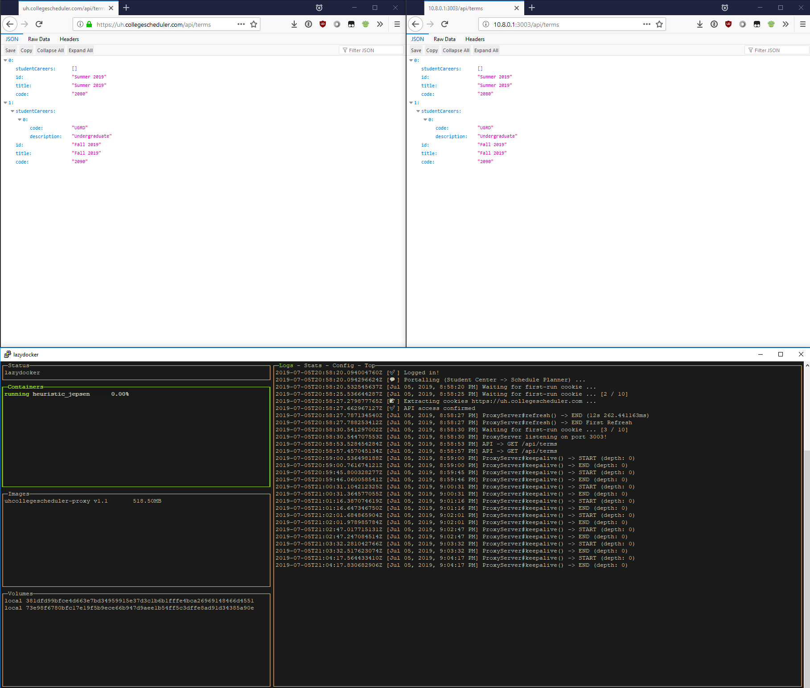

@cougargrades/collegescheduler
========================
📅📡 Local reverse-proxy to UH CollegeScheduler API that can be re-authenticated automatically to consistently access up-to-date course schedules and catalog data.

`https://uh.collegescheduler.com/` has a useful API for retrieving information about courses, however, it is only accessible during an active session made by digging through the MyUH portal. This project makes this API more accessible by sending background keepalive requests to make sessions last longer and refreshing login sessions behind the scenes to make the API more convenient to access for other applications.

It can even be run entirely in Docker.

<hr>



## Webserver

Proxies unauthenticated requests to the local webserver to `https://uh.collegescheduler.com/` with your cookie attached.

The webserver will automatically refresh the cookie with Puppet.js when the current one is expired, leaving no interruptions to API requests.

_Note: Do not leave the local server exposed to the open internet because every unauthenticated client acts on your behalf._

### Usage

#### Run inside Docker
This project is not on Docker Hub. To build from Github directly, follow these instructions.

- Clone the github repo:

    `git clone git@github.com:cougargrades/collegescheduler.git`
- `cd collegescheduler`
- Build the docker image locally

    `make build`
    
    OR

    `docker build . -t collegescheduler:dev`
- Create an `.env` file that is a copy of [`.env.example`](.env.example) with your own information.

    ```
    MY_UH_PEOPLESOFT_ID=1234567
    MY_UH_PASSWORD=hunter2
    PROXY_SERVER_PORT=3003
    ```
- Start a new container: 

    `docker run -i --env-file .env -p 3003:3003 collegescheduler:dev`

#### Run as standalone
- _Prerequisite: Make sure Puppet.js functions as intended and has no errors before starting the proxy server. See guide below._
- Install dependencies: `npm install`
- Specify desired port in `.env` or with variable `PROXY_SERVER_PORT`.
- Run server: `npm run server`

#### HTTP Responses
All HTTP responses that the proxy server makes are identical to those made to `https://uh.collegescheduler.com/`. However, there are some exceptions:
- _HTTP/511 Network Authentication Required_: 

    This means that you happened to catch the proxy server while it is in the middle of refreshing its cookie automatically. The refresh process takes about 10-13 seconds on a fast connection. After that period, your request will be serviceable while the backend is active on a new "session".
- _HTTP/502 Bad Gateway_:

    This means that there was a back-end error proxying this request. The error message is included. 

## Puppet.js
puppet.js uses [`puppeteer`](https://github.com/GoogleChrome/puppeteer/) to crawl my.uh.edu, portal to collegescheduler.com, and extract the cookies for use.

### Usage

_Note: Some environments will require [troubleshooting with puppeteer](https://github.com/GoogleChrome/puppeteer/blob/master/docs/troubleshooting.md). This project was designed with `google-chrome-unstable=77.0.3833.0-1` in mind. Future releases may require updating the npm module `puppeteer-core`._

#### Command-line tool
- With npm:
    - Install tool: `npm install -g cougargrades/collegescheduler`
    - Run tool: `npx uhcs_puppet --help`
- Cloning directly:
    - `git clone https://github.com/cougargrades/collegescheduler.git`
    - `cd collegescheduler/`
    - Install dependencies: `npm install`
    - Run tool: `./src/puppet.js --help`
- Copy example file: `cp .env.example .env`
- Edit `.env` file with login details
    - Or:
    - Specify the environment variables in your shell:
    - `$ MY_UH_PEOPLESOFT_ID=1234567`
    - `$ MY_UH_PASSWORD=hunter2`
- Follow instructions on running in the `--help` page.

    ```
    $ ./src/puppet.js -o cookiejar.json

    [💬] Login https://my.uh.edu ...
    [✅] Logged in!
    [💬] Portalling (Student Center -> Schedule Planner) ...
    [📝] Extracting cookies https://uh.collegescheduler.com ...
    [✅] API access confirmed
    [🍪] CookieJar written to cookiejar.json

    $ cat cookiejar.json
    {
    "version": "tough-cookie@3.0.1",
    ...
    "cookies": [
    {
    "key": "__RequestVerificationToken",
    "value": "...",
        ...
    },
    {
    "key": ".AspNet.Cookies",
    "value": "...",
    ...
    }
    ]
    }
    ```

#### Node module
- Developed with Node 10. Must support ES7 `async/await` and maybe other features.
- Install dependency: `npm install cougargrades/collegescheduler`
- Sample code:

    ```javascript
    const { Puppet } = require('@cougargrades/collegescheduler')

    let options = {
        logging: true, // [true | false]
        format: 'set-cookie' // ['jar' | 'set-cookie']
    }

    let cookie = await Puppet.extract('177554', 'secretpassword', options)

    console.log(cookie) // '__RequestVerificationToken=abcdef; AspNet.Cookies=uvwxyz'
    ```


<hr>

Reference:
- _[uh.edu/about/offices/enrollment-services/registrar/schedule-planner/](https://www.uh.edu/about/offices/enrollment-services/registrar/schedule-planner/)_
- _[uh.collegescheduler.com](https://uh.collegescheduler.com/)_
